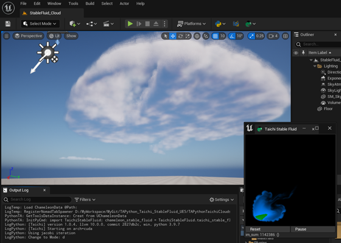

# TAPython_Taichi_Examples

## taichi fractal

本示例为演示TAPython使用taichi-lang的结果作为界面内容的最小范例

### Prerequisites
- unreal的python中安装taichi，确保在unreal的 python console中可以正确导入
- unreal中安装并启用TAPython插件
- 将TA目录中的内容合并到unreal工程目录中的TA目录中

### UE5中使用其他三方库的推荐做法：
1. 本地安装Python 3.9.7（UE5 使用的Python版本为3.9.7）
2. 创建UE5使用的Python虚拟环境
3. 在虚拟环境中，安装taichi等三方package
4. 在UE5中，将虚拟环境所在目录下的/Lib/site-packages 目录添加到 ProjectSetting/ Plugins-Python/Additional Paths中。重启编辑器

## 其他
### 通过TAPython和taichi-lang修改体积云覆盖范围的UE5工程：https://github.com/cgerchenhp/TAPython_Taichi_StableFluid_UE5

